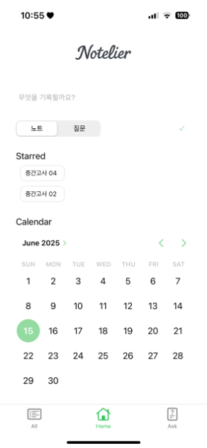
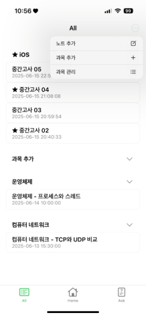
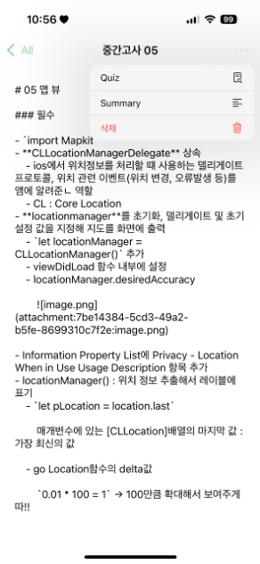
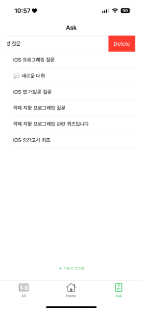
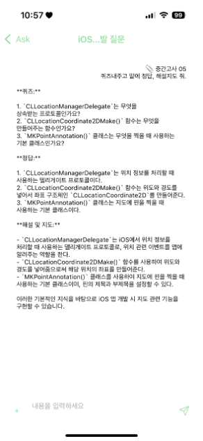

# Notelier

Notelier는 대학생의 강의 노트 작성과 복습을 돕는 iOS 학습 노트 앱입니다. 
노트를 과목별로 정리하고, 저장한 노트를 기반으로 OpenAI API를 사용해 요약, 질문 응답, 퀴즈 생성 기능 제공.


## 주요 기능

- 홈 화면에서 노트/질문 모드 선택
- 즐겨찾기 노트 빠른 접근
- 캘린더 기반 날짜별 노트 조회
- 전체 노트 과목별 그룹화
- 과목 섹션 접기/펼치기
- 노트 추가, 과목 추가, 과목 관리
- 노트 상세 수정 및 삭제
- 노트 기반 AI 요약/퀴즈 생성
- Ask 탭에서 AI 채팅 기록 관리
- 새 채팅 시작 및 기존 채팅 다시 열기
- AI 답변을 노트로 저장


## 화면 구성

<table>
  <tr>
    <td width="190">
      
    </td>
    <td>
      <b>Home</b>
      <ul>
        <li>노트/질문 모드 선택</li>
        <li>즐겨찾기 노트 빠른 접근</li>
        <li>캘린더 기반 날짜별 노트 조회</li>
      </ul>
    </td>
  </tr>
  <tr>
    <td width="190">
      
    </td>
    <td>
      <b>All</b>
      <ul>
        <li>과목별 노트 목록 확인</li>
        <li>과목 섹션 접기/펼치기</li>
        <li>노트 추가, 과목 추가, 과목 관리</li>
      </ul>
    </td>
  </tr>
  <tr>
    <td width="190">
      
    </td>
    <td>
      <b>Note Detail</b>
      <ul>
        <li>노트 본문 확인 및 편집</li>
        <li>Quiz/Summary 요청</li>
        <li>노트 삭제</li>
      </ul>
    </td>
  </tr>
  <tr>
    <td width="190">
      
    </td>
    <td>
      <b>Ask</b>
      <ul>
        <li>저장된 채팅 목록 확인</li>
        <li>새 채팅 시작</li>
        <li>채팅 기록 삭제</li>
      </ul>
    </td>
  </tr>
  <tr>
    <td width="190">
      
    </td>
    <td>
      <b>Chat Room</b>
      <ul>
        <li>AI 응답 확인</li>
        <li>이어서 질문</li>
        <li>노트 기반 퀴즈/요약 확인</li>
      </ul>
    </td>
  </tr>
</table>


## 기술 스택

- Swift 5
- UIKit
- Storyboard
- UserDefaults 기반 로컬 저장
- OpenAI Chat Completions API


## 프로젝트 구조

```text
Notelier/
├── AppDelegate.swift
├── SceneDelegate.swift
├── ViewController.swift                 # 홈 화면
├── NotesListViewController.swift        # 노트 목록 및 과목별 그룹
├── NoteDetailViewController.swift       # 노트 상세, 수정, 요약/퀴즈 진입
├── NewNoteViewController.swift          # 새 노트 작성
├── AddCourseViewController.swift        # 과목 추가
├── ManageCoursesViewController.swift    # 과목 관리
├── ChatHomeViewController.swift         # AI 채팅 목록
├── ChatRoomViewController.swift         # AI 채팅 화면
├── ChatRoom+*.swift                     # 채팅 입력, 첨부, UI, 키보드, 테이블 처리
├── NoteStorage.swift                    # 노트 저장/조회
├── ChatStorage.swift                    # 채팅 세션 저장/조회
├── OpenAI.swift                         # OpenAI API 호출
├── Base.lproj/
│   ├── Main.storyboard
│   └── LaunchScreen.storyboard
└── Assets.xcassets/
```


## 실행 방법

1. 저장소 클론

  ```bash
  git clone <repository-url>
  cd Notelier
  ```

2. Xcode에서 프로젝트 열기

  ```bash
  open Notelier.xcodeproj
  ```

3. 로컬 전용 OpenAI API 키 설정
  
  `Config/Secrets.xcconfig.example`을 복사해서 `Config/Secrets.xcconfig`를 만들고, 본인 키를 입력.
  
  ```bash
  cp Config/Secrets.xcconfig.example Config/Secrets.xcconfig
  ```
  
  ```xcconfig
  OPENAI_API_KEY = YOUR_OPENAI_API_KEY
  ```
  
  `Config/Secrets.xcconfig`는 `.gitignore`에 포함되어 GitHub에 올라가지 않음.

4. Xcode에서 시뮬레이터 또는 실제 기기 선택 후 실행


## 요구 사항

- Xcode
- iOS 18.5 이상
- OpenAI API 키


## 데이터 저장 방식

앱 데이터는 현재 `UserDefaults`에 저장.

- 노트: `savedNotes`
- 즐겨찾기 노트: `favoriteNotes`
- 과목: `SavedCourses`
- 즐겨찾기 과목: `favoriteCourses`
- 채팅 세션: `ChatSessions`

별도 서버나 데이터베이스 없이 로컬 기기 안에서 동작.


## OpenAI 연동

`OpenAI.swift`는 `https://api.openai.com/v1/chat/completions` 엔드포인트 호출. 현재 모델은 `gpt-3.5-turbo`로 설정되어 있으며, 다음 작업에 사용.

- 일반 질문 응답
- 노트 요약
- 노트 기반 퀴즈 생성
- 채팅 목적 감지
- 채팅 제목 자동 생성


## 보안 주의

OpenAI API 키를 `Info.plist`에 직접 저장하면 앱 번들에 포함될 수 있음.
이 프로젝트는 로컬 개발용으로 `Config/Secrets.xcconfig`에서 키를 주입. 배포 환경에서는 서버 프록시를 통해 OpenAI API를 호출하는 방식 권장.


## 라이선스

라이선스 정보 미지정.
